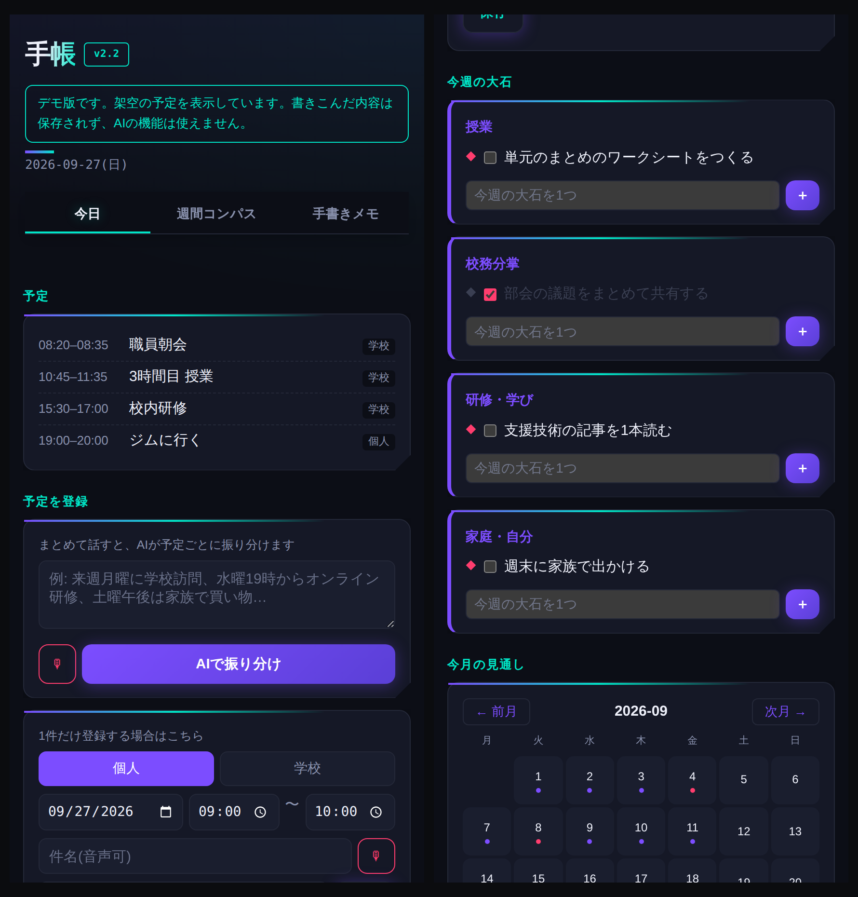

# techo（手帳）

役割がいくつもあり、それぞれが別々に動いている状態を、**1つの構造として見渡す**ための、自分用の手帳アプリです。
フランクリン・プランナーの「**使命 → 大きな石 → 日々の優先順位**」を土台にしています。



- デモを開く（架空のデータで画面を試せます。保存やAIの機能は動きません）：https://toitoitoi-lab.github.io/techo/
- 自分で使うには、自分の Google アカウントで下の「セットアップ」をしてください。

## つくった理由

授業、校務分掌、研修、家庭……。役割ごとに予定やタスクが別々の場所に散らばっていると、「今週、何がいちばん大事か」が見えなくなります。
そこで、使命から今日のタスクまでを1つの画面の流れでつなぐ手帳をつくりました。
**異動しても記録を失わないよう、職場ではなく個人の Google アカウントで動かします。**

## 画面の構成（3つのタブ）

| タブ | できること |
|---|---|
| **今日** | Google カレンダーの予定と学校の予定を1つの一覧で見る／予定をまとめて話すと AI が1件ずつに分ける／タスクに A・B・C の優先度を付ける（終わらなかったタスクは翌日に持ち越し） |
| **週間コンパス** | 使命・長期目標・当面の目標を書く／話した目標を AI が「長期・当面」×「A・B・C」に分ける／役割ごとに「今週の大石」を決める／月の見通しと週の見取り図 |
| **手書きメモ** | 1日1ページ、指やペンで書く。タイトルで検索できる |

音声入力（🎙）は、Chrome など音声認識に対応したブラウザで使えます。

## Google アカウント・カレンダーとのつながり

```
                 ┌─ Google カレンダー（自分のアカウントで見えるカレンダーを読む・個人の予定を書く）
index.html ─ Code.gs ─┼─ Google スプレッドシート「手帳データ」（タスク・大石・目標・ログ。初回に自動でつくる）
（画面）  （GAS）     ├─ Google ドライブ「手帳_手書きメモ」フォルダ（手書きメモの画像。共有はしない）
                 ├─ 外部カレンダーの限定公開 ICS（学校の予定などを読むだけ。任意）
                 └─ Gemini API（予定・タスク・目標の振り分け）
```

- **学校のカレンダーは「読むだけ」**：学校のアカウントとカレンダーを共有しなくても、学校カレンダーの「iCal 形式の限定公開 URL」を登録すれば、予定を表示できます。
- **「学校」を選んで登録した予定**は、スプレッドシートの「学校予定キュー」シートにたまります（学校のカレンダーへ直接は書きこみません）。学校側へ反映するには、学校のアカウントで別のしくみが必要です。
- **「個人」を選んだ予定**は、自分の Google カレンダーにすぐ登録されます。

## セットアップ（20分ほど）

1. https://script.google.com で新しいプロジェクトをつくります。
2. `コード.gs` の中身を、このリポジトリの `Code.gs` に置きかえます。
3. 左の「＋」→「HTML」で `index` という名前のファイルをつくり、`index.html` の中身を貼りつけます。
4. 「プロジェクトの設定」→「スクリプト プロパティ」に、次を登録します（名前は正確に）。

   | 名前 | 必須 | 値 |
   |---|---|---|
   | `GEMINI_API_KEY` | AI を使うなら必須 | https://aistudio.google.com/apikey で作ったキー |
   | `ICS_URLS` | 任意 | 1行に「ラベル\|URL」。例：`学校\|https://calendar.google.com/calendar/ical/…/basic.ics`（複数行可） |
   | `PLACES_API_KEY` | 任意 | 会場検索を使うときだけ。Google Cloud の Places API（**課金設定が必要**） |

5. 「デプロイ」→「新しいデプロイ」→ 種類「ウェブアプリ」。**実行ユーザー「自分」、アクセスできるユーザー「自分のみ」**にしてデプロイします。
6. 表示された `…/exec` の URL を開き、権限の確認を許可します（カレンダー・スプレッドシート・ドライブ・外部への接続）。スマホではホーム画面に追加すると便利です。

コードを直したときは「デプロイを管理」→ 編集 → 「新バージョン」で**同じデプロイを更新**してください。

## 注意

- 自分の予定やタスクが入るアプリです。**アクセスは必ず「自分のみ」**にしてください。
- 限定公開 ICS の URL は、知っている人なら誰でも予定を見られる URL です。スクリプト プロパティにだけ保存し、コードや公開の場に書かないでください。
- 「テストデータを全消去」は、スプレッドシートの中身だけを消します（カレンダーの予定は消えません）。

## 利用について

- コード：MIT ライセンス（`LICENSE` を参照）。自由に使い、改変できます。
- このアプリの考え方や使い方を研修・記事などで紹介するときは、事前にご連絡ください。→ https://toitoitoi-lab.github.io/rules/

作成：toi toi toi（https://toitoitoi-lab.github.io/）
